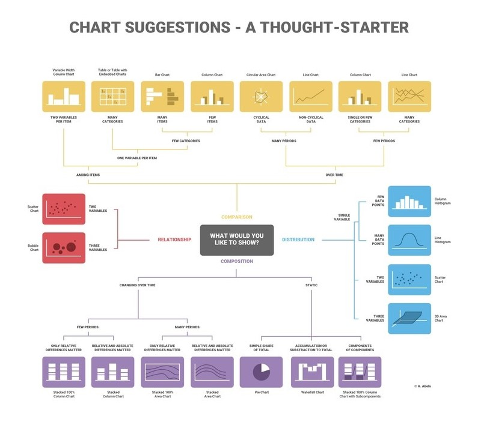

******

[Lien GitHub du projet](https://github.com/fuzellier/shiny_dashboard)

******

# Introduction

Dans le cadre du module de visualisation de données, nous avions abordé l’analyse exploratoire et pris en main des outils permettant de générer des graphiques grâce au langage R, à partir d’un ou plusieurs jeux de données. Ainsi, notre choix s'est porté sur des données statistiques relatives à l’animation japonaise. Celles-ci proviennent du site internet [MyAnimeList](https://myanimelist.net/) et contiennent également des informations publiques sur un certain nombre d'utilisateurs.

Ce projet de visualisation consiste en l'utilisation d'outils R adaptés afin de visualiser nos données, produire un rapport généré via R MarkDown et enfin concevoir une interface légère grâce à R Shiny.

******

# Outils et environnement de travail


## R et RStudio 
 
R est un langage de programmation dont le but est de pouvoir traiter et organiser des jeux de données afin de pouvoir y appliquer des tests statistiques plus ou moins complexes et se représenter ces données graphiquement à l'aide d'une grande variété de graphiques disponibles. RStudio est une application proposant un environnement de développement et des outils adaptés au langage et à l'environnement de programmation R. 

La fonction principale de RStudio consiste à faciliter le développement d'applications en langage R. Pour ce faire, le programme dispose de nombreux outils qui vous permettent notamment de créer des scripts, compiler du code, créer des graphes, ainsi que de travailler avec divers jeux de données. 

## R markdown

L’extension R markdown permet de générer des documents de manière dynamique en mélangeant texte mis en forme et résultats produits par du code R. Les documents générés peuvent être au format HTML, PDF, Word, et bien d’autres. C’est donc un outil très pratique pour l’exportation, la communication et la diffusion de résultats d’analyse.

## Shiny

Aujourd’hui, la référence de la création d’interface web sous R est Shiny. Shiny est un package R qui facilite la création d'applications web interactives depuis R. Celui-ci permet d’héberger des applications autonomes sur une page web, de les incorporer dans des documents R Markdown ou créer des tableaux de bord à partir de données statistiques.
 
Les résultats fournis sont réactifs : lorsque l'utilisateur fournit une nouvelle valeur d’entrée (ou *input*), le code R qui dépend de cette entrée est exécuté à nouveau, et la nouvelle sortie (ou *output*) est affichée. Ce type d’application est rendue dans un navigateur, et donc en HTML. Il est possible de concevoir une interface personnalisée avec du CSS ainsi que du JavaScript.

## Outils complémentaires 

* *shinydashboard* : Il permettra de créer une architecture dynamique à la page web avec une zone de titre, un menu rabattable et une zone principale ;
* *tidyverse* : Il s’agit d’une collection d’extensions relatives à la science des données, et permettant la manipulation des tableaux de données, l’import/export de données, la manipulation de variables ou, entre autres, la visualisation de données ;
* *data.table* : Extension et manipulation avancée des tableaux de données ;
* *viridis* : Propose une large gamme de palettes afin de mieux représenter les données, et les rendre plus accessibles aux personnes concernées par le daltonisme ;
* *plotly* et *highcharter* : Comme *ggplot2* (compris dans le *tidyverse*), ces packages permettent la visualisation de données, à la différence près qu’ils rendent ces graphiques interactifs ;
* *hrbrthemes* : Thèmes pour *ggplot2*.

******

```{r load, message=FALSE, warning=FALSE, include=FALSE}
# Import des packages
library(tidyverse)
library(knitr)
library(rmarkdown)
library(markdown)
library(data.table)
library(plotly)
library(viridis)
library(hrbrthemes)
library(lubridate)
library(highcharter)
library(shiny)
library(shinydashboard)
```

# Chargement et pré-traitement des données

Chargement des jeux de données

```{r datasets, message=FALSE}
df_anime <- fread(file='datasets/anime_filtered.csv')
df_users <- fread(file='datasets/users_filtered.csv')
```

Pré-traitement des données

```{r data_preprocess, message=FALSE, warning=FALSE}
# Colonne age des utilisateurs
users <- df_users[df_users$gender %in% c('Female', 'Male') & !is.null(df_users$birth_date)] %>% 
  select(username, gender, user_completed, user_days_spent_watching, birth_date)

users$age <- as.period(interval(start = users$birth_date, end = as.Date(now())))$year

# Dataset et nouvelles colonnes pour le graphe de densité par décennie
date_data <- df_anime %>% 
  rowwise() %>% 
  mutate(aired = str_extract_all(aired, "(None|[0-9]*-[0-9]+-[0-9]+)")[[1]][1]) %>% 
  ungroup() %>%
  mutate(
    year = as.integer(if_else(nchar(aired) == 10, substr(aired, 1, 4), NULL)),
    month = as.integer(if_else(nchar(aired) == 10, substr(aired, 6, 7), NULL)),
    season = if_else(month %in% c(1:3), 'Winter',
                     if_else(month %in% c(4:6), 'Spring',
                             if_else(month %in% c(7:9), 'Summer', 
                                     if_else(month %in% c(10:12), 'Autumn', NULL)))),
    year_season = paste(year, season),
    decade = as.factor(if_else(!is.na(year), 
                               paste(substr(year, 1, 3), "0's", sep = ''), NULL))
  ) %>% 
  arrange(year, month)

# Valeur médiane pour les boxplots
median_val <- df_anime %>% 
  select(scored_by, score) %>% 
  filter(scored_by > 99) %>% 
  summarize(median_sc = median(score))

# Extraire durée en minutes
duration_data <- df_anime %>% 
  mutate(h = if_else(str_detect(duration, "[0-9]*(?= hr.)"),
                         as.numeric(str_extract(duration, "[0-9]*(?= hr.)")), 0),
         m = if_else(str_detect(duration, "[0-9]*(?= min.)"),
                           as.numeric(str_extract(duration, "[0-9]*(?= min.)")), 0),
         s = if_else(str_detect(duration, "[0-9]*(?= sec.)"),
                           as.numeric(str_extract(duration, "[0-9]*(?= sec.)")), 0),
         duration = h*60 + m + s/60,
         duration = na_if(duration, 0))
```

******

# Visualisation des données

## Le choix d’un graphique

L’un des aspects importants dans la visualisation de données est le choix du type de graphiques. Afin de faire ce choix il faut d’abord déterminer ce que le graphique cherche à démontrer.

Il existe quatre grandes familles de graphiques :

<center>

</center>

* Comparaison : Les graphiques comparatifs sont utilisés pour comparer un ou plusieurs ensembles de données ou mettre en évidence des différences dans le temps ;
* Relation : Les graphiques pour relations montrent la connexion ou corrélation entre deux variables ou plus ;
* Composition : Les graphiques de composition sont utilisés pour afficher les parties d’un tout et l’évolution dans le temps ;
* Distribution : Les graphiques de distribution sont utilisés pour montrer comment les variables sont distribuées dans le temps, pour identifier les cas particuliers et les tendances.

******

## Vue d'ensemble (*overview*)

Code :
```{r line_nb_year, echo=TRUE, message=FALSE, warning=FALSE, fig.height=6, fig.width=9}
line_nb_year <- date_data %>% 
  filter(!is.na(year)) %>% 
  group_by("Year" = year) %>% 
  summarise(Freq = n()) %>%
  ggplot(aes(x = Year, y = Freq)) +
  geom_line(color = 'red', size = 1) +
  theme_ipsum() +
  theme(axis.title.x = element_text(size = 14),
        axis.title.y = element_text(size = 14)) +
  scale_x_continuous(
    expand = c(0, 0),
    limits = c(1910, 2017),
    breaks = seq(1910, 2017, 25)
  ) +
  scale_y_continuous(
    breaks = seq(0, 1000, 250),
    limits = c(0, 1000)
  ) +
  ggtitle("Number of anime per year")

line_nb_year <- ggplotly(line_nb_year)
line_nb_year
```

Ce graphique (*line chart*) représente l'évolution du nombre d'anime sortis par année. Le *line chart* est une bonne représentation de l'évolution (non-cyclique) d'une variable au fil du temps. En l'occurrence, il suffit d'un coup d'œil pour réaliser que le nombre de productions ne cesse de croître au fil des années.

******

Code :
```{r data_pie_type, echo=TRUE, message=FALSE, warning=FALSE}
data_pie_type <- df_anime %>% 
  filter(type != "Unknown") %>% 
  group_by("Type" = type) %>% 
  summarise(Freq = n())
    
highchart() %>% 
  hc_add_series( data_pie_type, hcaes(x = Type,y = Freq, color = Type), type = "pie") %>%
  hc_tooltip(borderWidth = 1.5, headerFormat = "",
  pointFormat = paste("<b>Type: {point.Type}</b> ({point.percentage:.1f}%)<br><b>Count:</b> {point.y}"))
```

Ce diagramme circulaire permet de représenter un petit nombre de valeurs par des angles proportionnels à ces dernières. Il indique la proportion des différents types d'anime, leur part parmi l'ensemble total des anime compris dans le jeu de données. Ici, on peut constater que le type TV (= séries d'animation diffusées à la télévision) représente une majorité d'anime, à savoir 29,6% d'entre eux, contrairement aux clips musicaux dont la part est de 5,9% seulement.

******

Code :
```{r score_source, echo=TRUE, message=FALSE, warning=TRUE, fig.height=6, fig.width=9}
score_source <- df_anime %>% 
  filter(airing == F & scored_by > 99) %>%
  select(score, scored_by, source) %>%
  ggplot(aes(x = source, y = score)) +
  geom_boxplot(fill = 'deepskyblue') + 
  geom_hline(aes(yintercept = median_val[[1]], linetype = 'median')) +
  scale_linetype_manual(name = '', values = c(median = 'dashed')) +
  coord_flip() + 
  theme_ipsum() +
  theme(
    axis.title.x = element_text(size=14),
    axis.title.y = element_blank(),
  ) +
  scale_y_continuous(limits = c(0, 10)) +
  ggtitle('Score Distribution by Source')

score_source <- ggplotly(score_source)
score_source
```

Ce graphique « boîte à moustaches » (*box plot*) permet d'obtenir un aperçu des données mesurées très rapidement, ici la distribution des notes par source (un anime peut être une production originale, mais il est généralement l'adaptation d'une œuvre déjà existante). 

Pour chaque « boîte », et donc chaque source, nous avons :
* Sa médiane (barre verticale à l'intérieure de la boîte) ;
* Les premier et troisième quartiles (respectivement les bords gauche et droit de la boîte) ;
* Les bornes inférieure et supérieure (respectivement le début et la fin du segment) ;
* Les valeurs potentiellement aberrantes (parfois des erreurs de saisie) sont représentées par les points noirs à gauche et/ou à droite de chaque segement.

Chaque borne inférieure est déterminée par ce calcul : $Q1 – (1.5 * IQR)$ où $Q1$ est le premier quartile et $IQR$ l'écart inter-quartile ($Q3 - Q1$). Si la valeur minimale de la distribution est supérieure au résultat donné par ce calcul, elle fera office de borne inférieure.

Le calcul de la borne supérieure est assez similaire : $Q3 + (1.5 * IQR)$. De la même manière, si la valeur maximale de la distribution est inférieure au résultat produit par ce calcul, elle fera office de borne supérieure.

Nous avons également ajouté une ligne en pointillé réprésentant la médiane globale, de tous les anime, indépendamment de la source.

Prenons l'example des manga numériques (*digital manga*) comme source, nous remarquons que la médiane se situe très à gauche de la boîte, même très proche du $Q1$ ou de la borne inférieure, ce qui représente une asymétrie très importante. En revanche, il ne semble y avoir aucune valeur potentiellement aberrante (pas de points noirs visibles), les bornes inférieure et supérieure sont donc déterminées respectivement par les valeurs minimum et maximum de la distribution.

Les anime adaptés de manga sont qui atteignent les notes les plus hautes, suivis de très près par les adaptation de *light novels* dont même le premier quartile $Q1$ est supérieur à la médiane globale !

******

Code :
```{r score_type, echo=TRUE, message=FALSE, warning=TRUE, fig.height=6, fig.width=9}
score_type <- df_anime %>% 
  filter(airing == F & scored_by > 99) %>%
  select(score, scored_by, type) %>%
  ggplot(aes(x = type, y = score)) +
  geom_boxplot(fill = 'deepskyblue') + 
  geom_hline(aes(yintercept = median_val[[1]], linetype = 'median')) +
  scale_linetype_manual(name = '', values = c(median = 'dashed')) +
  coord_flip() + 
  theme_ipsum() +
  theme(
    axis.title.x = element_text(size = 14),
    axis.title.y = element_blank(),
  ) +
  scale_y_continuous(limits = c(0, 10)) +
  ggtitle('Score Distribution by Type')

score_type <- ggplotly(score_type)
score_type
```

Il s'agit du même type de graphique que ci-dessus, ainsi la logique à suivre est la même, seulement il s'agit ici de la distribution des notes par type.

Nous pouvons, par exemple, remarquer que les clips musicaux ainsi que les ONA (*Original net animation*, des productions directement diffusées sur internet, sur des plateformes de streaming) sont généralement moins bien notés que les autres. D'autre part, les séries d'animation diffusées à la télévision et les films s'en sortent beaucoup mieux.

******

Code :
```{r score_notes, echo=TRUE, fig.height=8, fig.width=10, message=FALSE, warning=FALSE}
rs_score_notes <- df_anime %>%
  filter(airing == F & scored_by > 99) %>%
  ggplot(aes(x = scored_by, y = score)) +
  stat_bin_hex(bins = 50) +
  theme_ipsum() +
  scale_fill_viridis() +
  stat_smooth(
    method = 'lm',
    color = 'red',
    formula = y ~ log(x)
  ) +
  theme(
    axis.title.x = element_text(size=14),
    axis.title.y = element_text(size=14)
  ) +
  scale_y_continuous(
    limits = c(2, 9.5),
    breaks = seq(2, 9.5)
  ) +
  labs(title = 'Relationship between Score and Scored_by', x = "Scored by # people", y = "Score")

rs_score_notes <- ggplotly(rs_score_notes)
rs_score_notes
```

Grâce au graphique ci-dessus, il est possible de faire correspondre à l'intensité d'une grandeur variable une gamme de tons de couleurs. Il divise le plan en hexagones qui comptent le nombre de groupes d'anime (ici un groupe = 50 animes). Il ne s'agit que d'un choix arbitraire pour représenter au mieux les données, l'intérêt ici est avant tout de montrer la relation entre le score d'un anime et le nombre de notes attribuées à ce dernier. Le graphique dégage une tendance, en effet plus un anime est noté par un grand nombre d'utilisateurs, plus il est susceptible d'être très bien noté.

******

## Séries d'animation (*TV anime*)

Code :
```{r score_year_tv, echo=TRUE, message=FALSE, warning=FALSE, fig.height=6, fig.width=9}
score_year_tv <- date_data %>% 
  filter(score != 0, scored_by > 10, type == 'TV') %>% 
  group_by("Year" = year) %>% 
  summarise(avg = round(mean(score, na.rm = T), 2)) %>%
  ggplot(aes(x = Year, y = avg)) +
  geom_line(color = 'red', size = 1) +
  theme_ipsum() +
  theme(axis.title.x = element_text(size = 14),
        axis.title.y = element_text(size = 14)) +
  scale_x_continuous(
    expand = c(0, 0),
    limits = c(1960, 2017),
    breaks = seq(1960, 2017, 10)
  ) +
  scale_y_continuous(
    breaks = seq(6, 7.5, 0.2),
    limits = c(6, 7.5)
  ) +
  labs(title = "Average score per year", y = "Average score")

score_year_tv <- ggplotly(score_year_tv)
score_year_tv
```

Ce *line chart* représente l'évolution des notes au cours du temps. La moyenne des notes attribuées à des productions datant des années 1978 ou 1996 est très haute, contrairement à 1965 dont la moyenne est au plus bas. On remarque également une chute notable durant les années 2010.

******

Code :
```{r ratings_tv_decade, echo=TRUE, message=FALSE, warning=FALSE, fig.height=6, fig.width=9}
ratings_tv_decade <- date_data %>%
  filter(!is.na(decade), type == "TV") %>% 
  group_by("Decade" = decade, rating, .drop = F) %>% 
  summarise(Freq = n()) %>%
  ggplot(aes(x = Decade, y = Freq, group = rating, shape = rating, color = rating)) +
  geom_line(size = 1) +
  geom_point(size = 2) +
  theme_ipsum() +
  theme(axis.title.x = element_text(size = 14),
        axis.title.y = element_text(size = 14)) +
  scale_y_continuous(
    breaks = seq(0, 1250, 250),
    limits = c(0, 1250)
  ) +
  ggtitle("Ratings evolution during decades")

ratings_tv_decade <- ggplotly(ratings_tv_decade)
ratings_tv_decade
```

Ce graphique représente l'évolution de la classification au fil des décennies. On remarque rapidement que les productions ciblant un public agé de 13 ans ou plus sont de plus en plus nombreuses.

******

Code :
```{r bbl_100, echo=TRUE, message=FALSE, warning=FALSE, fig.height=6, fig.width=9}
bbl_chart <- df_anime[df_anime$popularity != 0] %>% 
  arrange(popularity) %>% head(n = 100) %>%
  select(popularity, rank, title, scored_by, favorites, score) %>%
  filter(popularity <= 100) %>%
  mutate(point = (as.numeric(scored_by) * as.numeric(favorites) * as.numeric(score)) / 10^10) %>% 
  ggplot(aes(x = rank, y = popularity, size = point, color = popularity, text = title)) +
  geom_point(alpha = 0.7) +
  scale_size(range = c(0, 19)) +
  scale_color_viridis() +
  theme_ipsum() +
  theme(
    axis.title.x = element_text(size = 14),
    axis.title.y = element_text(size = 14)
  ) +
  scale_x_continuous(
    limits = c(0, 100),
    breaks = seq(0, 100, 10)
  ) +
  scale_y_continuous(
    limits = c(-5, 100),
    breaks = seq(0, 100, 25)
  ) +
  labs(title='TOP 100 Anime by rank and popularity', x = 'Rank', y = 'Popularity')

bbl_chart <- ggplotly(bbl_chart, tooltip = c('rank', 'popularity', 'title'))
bbl_chart
```

Ce *bubble chart* représente les 100 animes les plus populaires. Ils sont représentés en fonction de leur rang dans le classement et de leur popularité. Le choix de ce type de graphique repose également sur une troisième variable qui s'ajoute aux deux précentes, une variable *point* dont la formule se base sur le nombre de notes attribuées, le score ainsi que le nombre d'utilisateur ayant cet anime dans ses favoris. Elle sert à déterminer la taille de chaque bulle (donc la taille minimale est fixe dans le code).

On peut constater qu'en s'appuyant les effets de ces 3 variables, *Fullmetal Alchemist: Brotherhood* semble être l'anime le mieux considéré par les utilisateurs de MyAnimeList (car le mieux noté, l'un des plus populaires, des plus notés et des plus représentés dans les favoris des membres).

******

Code :
```{r line_100, echo=TRUE, fig.height=5, fig.width=10, message=FALSE, warning=FALSE}
point_plot_pop <- df_anime[df_anime$popularity != 0] %>%
  arrange(popularity) %>% head(n = 100) %>% 
  select(title, popularity, rank) %>%
  ggplot(aes(x = popularity, y = rank)) +
  geom_line(color = 'black') +
  geom_point(size = 2, color = 'red') +
  theme_ipsum() +
  theme(axis.title.x = element_text(size=14),
        axis.title.y = element_text(size=14)) +
  scale_x_continuous(
    expand = c(0, 0),
    limits = c(-1, 101),
    breaks = seq(0, 100, 5)
  ) +
  scale_y_continuous(
    breaks = seq(0, 3000, 500),
    limits = c(0, 3000)
  ) +
  ggtitle('Top 100 anime with their rank score')
  
point_plot_pop <- ggplotly(point_plot_pop)
point_plot_pop
```

Ce graphique reprend 2 des variables utilisées dans le graphique précédent, à savoir le rang et la popularité. Il représente les 100 anime les plus populaires et leur rang associé.

On remarque par exemple que le 17e anime le plus populaire est pourtant assez bas dans le classement (rang 2827).

```{r rank_17_infos, echo=FALSE, warning=FALSE}
df_anime %>% filter(popularity == 17) %>% select(title, popularity, rank, score)
```

******

Code :
```{r score_density_decade, echo=TRUE, message=TRUE, warning=TRUE, fig.height=5, fig.width=10}
score_density_dec <- date_data %>%
  select(decade, type, score) %>%
  filter(!is.na(decade), type == 'TV', score != 0) %>% 
  ggplot(aes(score, group = decade, fill = decade)) +
  geom_density(adjust = 1.25, alpha = .75) +
  theme_ipsum() +
  theme(
    legend.position='top',
    axis.title.x = element_text(size=14),
    axis.title.y = element_text(size=14),
  ) +
  scale_x_continuous(
    limits = c(0, 10),
    breaks = seq(0, 10, 2.5)
  ) +
  scale_y_continuous(
    expand = c(0, 0),
    limits = c(0, 1),
    breaks = seq(0, 1, 0.25)
  ) +
  ggtitle('TV anime score density by decade')

score_density_dec <- ggplotly(score_density_dec)
score_density_dec
```

Ce graphique représente la distribution des notes par décennie. Le graphique en aires empilées peut comporte plusieurs séries. Il met à la fois l'accent sur les changements dans le temps et sur les totaux de chaque catégorie. Dans ce type de graphique une aire peut en cacher une autre, mais ici les formes des courbes permettent d'avoir un bon aperçu des valeurs mesurées.

On remarque qu'au fil des décennies, les anime ont tendance à être de mieux en mieux notés. En revanche, les notes sont plus étalées, elles sont globalement mieux réparties, contrairement aux années 1960 à 1980 qui montrent une forte concentration des notes attribuées entre 6 et 7.

******

## Films d'animation

Code :
```{r score_year_movie, echo=TRUE, message=FALSE, warning=FALSE, fig.height=6, fig.width=9}
score_year_movie <- date_data %>% 
  filter(score != 0, scored_by > 10, type == 'Movie') %>% 
  group_by("Year" = year) %>% 
  summarise(avg = round(mean(score, na.rm = T), 2)) %>%
  ggplot(aes(x = Year, y = avg)) +
  geom_line(color = 'red', size = 1) +
  theme_ipsum() +
  theme(axis.title.x = element_text(size = 14),
        axis.title.y = element_text(size = 14)) +
  scale_x_continuous(
    expand = c(0, 0),
    limits = c(1930, 2017),
    breaks = seq(1930, 2017, 25)
  ) +
  scale_y_continuous(
    breaks = seq(4.5, 7.5, 0.5),
    limits = c(4.5, 7.5)
  ) +
  labs(title = "Average score per year", y = "Average score")


score_year_movie <- ggplotly(score_year_movie)
score_year_movie
```

aaaaaaaaaaaaaaaa

******

Code :
```{r ratings_movie_decade, echo=TRUE, message=FALSE, warning=FALSE, fig.height=6, fig.width=9}
ratings_movie_decade <- date_data %>%
  filter(!is.na(decade), type == "Movie") %>% 
  group_by("Decade" = decade, rating, .drop = F) %>% 
  summarise(Freq = n()) %>%
  ggplot(aes(x = Decade, y = Freq, group = rating, shape = rating, color = rating)) +
  geom_line(size = 1) +
  geom_point(size = 2) +
  theme_ipsum() +
  theme(axis.title.x = element_text(size = 14),
        axis.title.y = element_text(size = 14)) +
  scale_y_continuous(
    breaks = seq(0, 300, 50),
    limits = c(0, 300)
  ) +
  ggtitle("Ratings evolution during decades")

ratings_movie_decade <- ggplotly(ratings_movie_decade)
ratings_movie_decade
```

aaaaaaaaaaaaaaaaa

******

Code :
```{r score_density_movie, echo=TRUE, message=FALSE, warning=FALSE, fig.height=6, fig.width=9}
score_density_movie <- date_data %>% 
  filter(!is.na(decade), type == 'Movie', score != 0) %>% 
  select(decade, type, score) %>% 
  ggplot(aes(score, group = decade, fill = decade)) +
  geom_density(adjust = 1.25, alpha = .7) +
  theme_ipsum() +
  theme(
    legend.position='top',
    axis.title.x = element_text(size=14),
    axis.title.y = element_text(size=14),
  ) +
  scale_x_continuous(
    limits = c(0, 10),
    breaks = seq(0, 10, 2.5)
  ) +
  scale_y_continuous(
    expand = c(0, 0),
    limits = c(0, 1),
    breaks = seq(0, 1, 0.25)
  ) +
  ggtitle("Movies score density by decade")

score_density_movie <- ggplotly(score_density_movie)
score_density_movie
```

aaaaaaaaaaaaaaaa

******

## Utilisateurs

Code :
```{r box_gender_age, echo=TRUE, message=FALSE, warning=FALSE}
box_gender_age <- users %>% 
  ggplot(aes(x = gender, y = age, fill = gender)) +
  geom_boxplot() +
  theme_ipsum() +
  theme(
    legend.position='none',
    axis.title.x = element_text(size=14),
    axis.title.y = element_text(size=14)
  ) +
  scale_y_continuous(
    expand = c(0, 0),
    limits = c(-1, 60),
    breaks = seq(0, 60, 5)
  ) +
  ylab("Age")

box_gender_age <- ggplotly(box_gender_age)
```

```{r box_gender_spent, echo=TRUE, message=FALSE, warning=FALSE}
box_gender_spent <- users %>% 
  ggplot(aes(x = gender, y = user_days_spent_watching, fill = gender)) +
  geom_boxplot() +
  theme_ipsum() +
  theme(
    legend.position = 'none',
    axis.title.x = element_text(size=14),
    axis.title.y = element_text(size=14)
  ) +
  scale_y_continuous(
    expand = c(0, 0),
    limits = c(-1, 301),
    breaks = seq(0, 300, 50)
  ) +
  labs(title = "Users' age and days spent by gender", y = "Time spent (in days)")

box_gender_spent <- ggplotly(box_gender_spent)
```

```{r sub_boxplot, echo=TRUE, fig.height=6, fig.width=9, message=TRUE, warning=TRUE}
subplot <- subplot(box_gender_age, box_gender_spent, nrows=1, titleY = T, margin = 0.07)
subplot
```

aaaaaaaaaaa

******

Code :
```{r scatter_age, echo=TRUE, fig.height=6, fig.width=9, message=FALSE, warning=FALSE}
scatter_age <- users %>%
  ggplot(aes(x = age, y = user_days_spent_watching, color = gender)) +
  stat_bin_hex(bins = 75, alpha = 0.6)  +
  scale_color_manual(values= c('red', 'blue')) +
  theme_ipsum() +
  theme(
    legend.position = 'none',
    axis.title.x = element_text(size=14),
    axis.title.y = element_text(size=14),
    panel.grid.major = element_blank(),
    panel.grid.minor = element_blank()
  ) +
  scale_x_continuous(
    expand = c(0, 0),
    limits = c(-1, 81),
    breaks = seq(0, 80, 5)
  ) +
  scale_y_continuous(
    expand = c(0, 0),
    limits = c(-1, 1001),
    breaks = seq(0, 1000, 200)
  ) +
  labs(title = "Anime watchers' age", x = "Age", y = "Time spent (in days)")
  
scatter_age <- ggplotly(scatter_age)
scatter_age
```


******

# Interface Shiny

## Spécificités liées à Shiny

L’application suit l’architecture classique déterminée par Shiny lors de la création d’un nouveau projet, ainsi elle se divise en deux parties :

### Interface utilisateur (UI)
Il s’agit de l’interface utilisateur visible dans une page web. Elle regroupe tous les éléments de mise en forme et d'affichage de l'interface elle-même, on y retrouve les graphes, les tableaux ainsi que du texte, entre autres. L’utilisateur pourra interagir avec cette interface par le biais de boutons, de sliders, de cases, etc.

### Le serveur

Il s’agit de la « zone de travail ». Tous les calculs, toute la partie préparation et traitement des données, ou bien les analyses à réaliser sont faites côté serveur. Le code exécuté sert à produire les éléments qui sont affichés par l’interface, et à les mettre à jour en cas de changement dans les valeurs d’entrée.

<center>

</center>

### Input et Output

D’une part, les inputs sont les composants (widgets) de l'interface graphique qui permettent aux utilisateurs de fournir des valeurs aux paramètres d'entrée. D’autre part, les outputs sont les composants qui permettent d'afficher des éléments résultant d'un traitement dans R (graphiques, tableaux, textes, ...). 

### Bootstrap

Shiny utilise également le framework JS/CSS Bootstrap qui définit une page telle une grille : une page est divisée en colonnes (column()) et en lignes (fluidRow()), la hauteur d'une ligne est celle de son plus grand élément, la page est divisée en 12 colonnes, une colonne de largeur 6 occupera donc la moitié de l'espace horizontal.

### Panels

Les panels permettent de réunir différents éléments (widgets, textes, images...). Les différents types de panels correspondent à différents styles (par exemple, headerPanel(), sidebarPanel(), tabPanel()) Il est possible de combiner différents types de panels en les juxtaposant ou en les emboîtant.

### Réactivité

<center>

</center>

À chaque changement de l'input x, l'expression est réévaluée et met à jour l'output y.

## Structure globale de l'interface

<center>

</center>

### Sidebar

Notre interface étant de type tableau de bord, elle possède une sidebar Shiny. La Sidebar est une barre latérale qui s'affiche avec une couleur d'arrière-plan distincte et contient des contrôles d'entrée. Elle occupe moins d’1/3 de la largeur horizontale de l’interface et est rétractable de manière responsive. Tout comme le header, elle est fixe et accompagne l’utilisateur lorsque la page défile (scrolling).

### Onglets
 
* Overview : Vue d’ensemble sur les données ;
* TV Anime : Visualisation sur les données relatives aux séries d’animation ;
* Movies : Idem, cette fois-ci concernant les films d’animation ;
* Users : Quelques graphiques sur les données utilisateurs ;
* Data : Affichage des jeux de données, navigation dans ceux-ci et téléchargement possible au format CSV via boutons cliquables.


De 3 onglets contiennent des des *valueBoxes*, celles-ci mettent en lumière une valeur jugée importante et l’accompagnent d’un sous-titre descriptif.

<center>

</center>
 
Par exemple, la première affiche le nombre total d’animes japonais (quel que soit le type) contenus dans le jeu de données. La seconde affiche le genre le plus représenté, à savoir celui de la « Comédie ».

En outre, certains graphiques similaires ou utilisant un même panel de contrôles peuvent être agencés en sous-onglets. Idem pour l’onglet « data » afin de passer d’un jeu de données à l’autre en un clic, sans encombrer la page de plusieurs tableaux les uns à la suite des autres.


Nous avons également travaillé l’ergonomie de notre architecture Shiny afin de la rendre plus ergonomique. Pour cela notre travail nous avons pris en compte la gestion des couleurs.


### Palette de couleurs Viridis

La palette viridis a été développée pour la première fois pour le paquet python matplotlib, et a été implémentée dans R depuis. Les points forts de cette palette sont que ses couleurs sont parfaitement uniformes sur le plan de la perception, même lorsqu'elles sont imprimées en noir et blanc et les couleurs sont perçues par les formes les plus courantes de daltonisme.


# Bilan du projet

La visualisation des données est un ensemble de méthodes de représentation graphique, en deux ou trois dimensions, utilisant ou non de la couleur et des trames. Les moyens informatiques permettent de représenter des ensembles complexes de données, de manière plus simple, didactique et pédagogique.

Ce projet a été réalisé dans le cadre du cours de visualisation de données. Celui-ci convoque des connaissances variées et fait le lien entre plusieurs modules de notre formation, afin de concevoir une application fonctionnelle prenant en compte l’expérience utilisateur et les mécanismes cognitifs qui lui sont inhérents. Il a été l’occasion pour nous, étudiants, de consolider des compétences en analyse, manipulation et visualisation de données, puis en acquérir de nouvelles par le biais d’outils permettant la création d’une interface intuitive basée sur ces dernières.


